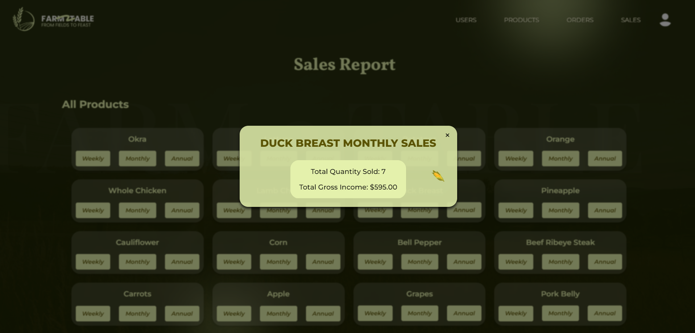

# CMSC100-U4L-Project-Group2

Welcome to Farm2Table!

To experience the true taste of farm-fresh goodness, clone the repository in your device. Move to the /backend directory and run node index.js. In another terminal, move to /frontend/project and run npm start. Have fun!

Farm2Table opens with a landing page that shows options to indicate whether the user is a customer or an admin.

Proceeding to the user login page, it requires an email address and a password to log in. Entering the wrong details will prompt an error message. A new account can also be made through the sign up link just below the fields.

Upon clicking 'Sign Up,' the user is then led to a separate page where it requires their full name, email address, and password for the account.

Both Sign In and Sign Up pages lead to the user landing page where they can access the product listing, their previous orders, and their shopping cart through the navigation bar.

Accessing the Products page leads to the product listings. Each product is displayed with a product name, description, price, quantity, an image, and a button that allows the user to add the product to their cart. The products can be sorted by name, type, price, and quantity, in either an ascending or descending order. It can also be filtered by type.

A user's shopping cart consists of the items they have previously added. They can also choose which products to buy through the checkboxes. Checking out will automatically result to a pending order which the user can check through the Orders page.

The Orders page contains the user's past transactions, including their Pending, Cancelled, and Completed orders. An order will remain pending until the admin confirms it. Users can cancel their pending orders anytime. Once an order is completed, it is final.

At the upper right corner of the page, there is a logout button that leads right back to the main landing page.

For the admin login page, there are no options to create a new account because there is only one admin account.

The landing page shows the admin dashboard. Here, they can access the products, user accounts, order transactions, and sales reports.

The Products page has the same content as the user's with the exception of the stock update buttons. The admin can increase or decrease a product's stock through this page.

The User Management page contains the list of registered users, their full name and email address. It also returns the total number of registered users. The list can be sorted by first name, last name, or email address.

The Order Fulfillment page contains all users' order transactions. The orders listed under pending can be either confirmed or cancelled by the admin, which will then transfer the order to its respective tab.

The Sales Report page gives a list of the existing products. It allows the admin to view a product's weekly, monthly, and annual sales.

Thank you! We hope you enjoy the true taste of farm-fresh goodness with Farm2Table!

Developers

Erjoy Constantine Robles
Kathleen Kate Leoncio
Jerico Dane Sanchez
Angelica Michelle Jacob

CMSC 100 U-4L